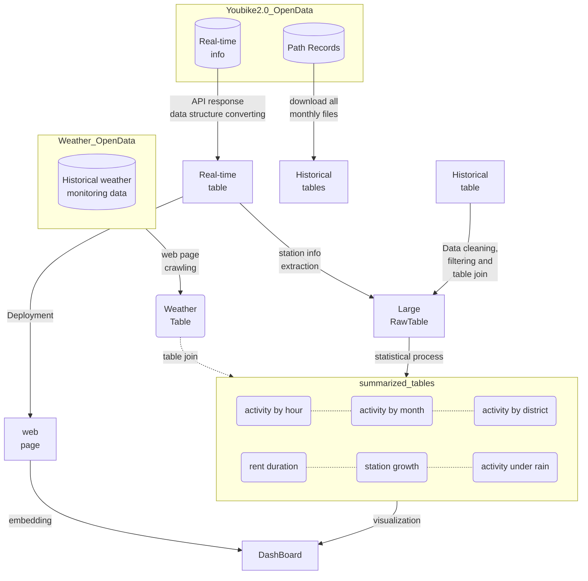

# YouBike2.0 Taipei City
## Side project for YouBike2.0 OpenData visualization and analysis
* Please visit following [Tableau Dashboard](https://ccl-chun.github.io/ubike2_taipei_city/TableauDashBoard.html) to interact with data

preview: 

<noscript></noscript><object class='tableauViz'  style='display:none;'><param name='host_url' value='https%3A%2F%2Fpublic.tableau.com%2F' /> <param name='embed_code_version' value='3' /> <param name='site_root' value='' /><param name='name' value='Youbike2_0tracing&#47;summary' /><param name='tabs' value='no' /><param name='toolbar' value='yes' /><param name='static_image' value='https:&#47;&#47;public.tableau.com&#47;static&#47;images&#47;Yo&#47;Youbike2_0tracing&#47;summary&#47;1.png' /> <param name='animate_transition' value='yes' /><param name='display_static_image' value='yes' /><param name='display_spinner' value='yes' /><param name='display_overlay' value='yes' /><param name='display_count' value='yes' /><param name='language' value='zh-TW' /></object>

## Features
### This repository contains scripts to prepare data tables for visualization and further analysis
* Here is a simple flow chart:

* details of deploy Real-time info web page please see [here](https://github.com/CCL-Chun/ubike2.0_api_catch)

### Brief intro of files in scripts/
* [region_coordinates.sh](https://github.com/CCL-Chun/ubike2_taipei_city/blob/main/scripts/region_coordinates.sh)

  Extract station name, district, longitude and latitude from API response.[Taipei City YouBike2.0 API](https://tcgbusfs.blob.core.windows.net/dotapp/youbike/v2/youbike_immediate.json)

  *see the code below to get API response(catch_taipeicity_ubike2_per_min.py)

* [station_name_check.R](https://github.com/CCL-Chun/ubike2_taipei_city/blob/main/scripts/station_name_check.R)

  This R script handles stations name with weired or garbled characters or synonumous and then unifies them for further table join

* [download.sh](https://github.com/CCL-Chun/ubike2_taipei_city/blob/main/scripts/download.sh)

  Download all exist zip files from OpenData (all urls were extracted from csv)

* [read_monthly_data_analysis.R](https://github.com/CCL-Chun/ubike2_taipei_city/blob/main/scripts/read_monthly_data_analysis.R)

  Read all zip files using [data_plastic.sh](https://github.com/CCL-Chun/ubike2_taipei_city/blob/main/scripts/data_plastic.sh) and process all info corrections, table join and processed tables for visualisation

* [data_plastic.sh](https://github.com/CCL-Chun/ubike2_taipei_city/blob/main/scripts/data_plastic.sh)

  Dealing with zip files(csv inside) downloading from youbike2.0 and output tab seperation table

  removing characters that didn't support by UTF-8 or other encodes (some stations' name, details in station_name_check.R)

* [catch_taipeicity_ubike2_per_min.py](https://github.com/CCL-Chun/ubike2_taipei_city/blob/main/scripts/catch_taipeicity_ubike2_per_min.py)

  Retrieve instant information from OpenData [Taipei City YouBike2.0 API](https://tcgbusfs.blob.core.windows.net/dotapp/youbike/v2/youbike_immediate.json)

  This python script contains three main functions:
  1) Get the API response per minutes and save to a timestamp file
  2) Check the response status in 10 seconds and retry after 5 seconds to avoid time-out error
  3) Convert JSON data to tab-seperate format 

* [new_catch_weather_data.py](https://github.com/CCL-Chun/ubike2_taipei_city/blob/main/scripts/new_catch_weather_data.py)

  Crawls the [CWA Observation Data Inquire System](https://e-service.cwb.gov.tw/HistoryDataQuery/) website for daily weather monitoring data. The script will crawl the website for each day between the start date and the end date. For each day, the script will extract the hourly weather data from the monitoring table.

